# Relational Functional Geometry

A mathematical system where pure functions are represented as geometric points, modules are VM runners, and function composition is modeled as topological relations.

## 🧩 Core Mathematical Concept

> **Each pure function is a point in geometric space.**
> **Its binary encoding is its unique identity.**
> **Function composition {p,q} produces different results if different, same if same, or 0 if incompatible.**

## 🔬 Mathematical Foundations

### Function Space Definition

Let \( \mathcal{F} \) be the space of all pure functions, and \( E: \mathcal{F} \to \mathbb{H} \) be the encoding function that maps each function to its binary hash.

### Execution Relation

Define the execution relation \( R: \mathcal{F} \times \mathcal{F} \to \mathbb{R} \cup \{0\} \) as:

\[
R(p,q) = \begin{cases}
\text{hash}(p(q)) & \text{if } p(q) \text{ executes successfully} \\
0 & \text{if } p(q) \text{ fails or throws}
\end{cases}
\]

### Equivalence Classes

Two functions \( p \) and \( q \) are **equivalent** if:
- \( R(p,q) = R(q,p) \) (commutative)
- \( R(p,q) \neq 0 \) (compatible)

### Topological Structure

The function space forms a **directed graph** where:
- **Vertices** = Encoded functions
- **Edges** = Execution relations
- **Edge weights** = Result hashes

## 🎯 Key Properties

### 1. **Commutativity Detection**
```typescript
const f = (x: number) => x + 1;
const g = (x: number) => x + 1;
// R(f,g) === R(g,f) → Commutative
```

### 2. **Compatibility Validation**
```typescript
const f = (x: number) => x + 1;
const g = (x: any) => { throw new Error(); };
// R(f,g) === 0 → Incompatible
```

### 3. **Function Set Validity**
A set \( \{p_1, p_2, \ldots, p_n\} \) is **valid** if:
\[
\prod_{i < j} R(p_i, p_j) \neq 0
\]

## 🌐 Topological Analysis

### Connected Components
Functions that can be composed in a chain form connected components.

### Cycles
Circular dependencies in function composition create cycles.

### Bridges
Edges whose removal disconnects the graph are bridges.

## 🧮 Function Composition Algebra

### Associativity
\[
(f \circ g) \circ h = f \circ (g \circ h)
\]

### Identity
\[
f \circ \text{id} = \text{id} \circ f = f
\]

### Composition Closure
If \( f \) and \( g \) are compatible, then \( f \circ g \) is defined.

## 🔧 Implementation Details

### Function Encoding
```typescript
function encode(fn: Function): string {
  const source = fn.toString();
  return createHash('sha256').update(source).digest('hex');
}
```

### Execution Relation
```typescript
function executeRelation(p: Function, q: Function): string | 0 {
  try {
    const result = p(q);
    return createHash('sha256').update(JSON.stringify(result)).digest('hex');
  } catch {
    return 0;
  }
}
```

### Compatibility Check
```typescript
function compare(p: Function, q: Function): ComparisonResult {
  const r1 = executeRelation(p, q);
  const r2 = executeRelation(q, p);
  
  if (r1 === 0 || r2 === 0) {
    return { result: 0, commutative: false, valid: false };
  }
  
  return {
    result: r1 === r2 ? 1 : -1,
    commutative: r1 === r2,
    valid: true
  };
}
```

## 📊 Visualization

### Mermaid Diagram

```mermaid
graph TD
  f1["🔵 f1"] -->|"≡"| f2["🔵 f2"]
  f2 -->|"≠"| f3["🔵 f3"]
  f3 -->|"≡"| f1
```


### Graphviz DOT


## 🎯 Applications

### 1. **Code Analysis**
- Identify compatible function sets
- Detect circular dependencies
- Find function composition patterns

### 2. **Refactoring**
- Suggest function combinations
- Identify redundant functions
- Optimize function composition

### 3. **Testing**
- Generate test cases from function relations
- Identify edge cases
- Validate function compatibility

### 4. **Documentation**
- Generate function relationship diagrams
- Create API documentation
- Visualize code structure

## 🔬 Mathematical Properties

### Transitivity
If \( R(p,q) \neq 0 \) and \( R(q,r) \neq 0 \), then \( R(p,r) \neq 0 \).

### Symmetry
\( R(p,q) = R(q,p) \) if and only if \( p \) and \( q \) are commutative.

### Reflexivity
\( R(p,p) \neq 0 \) for all functions \( p \).

### Closure
The set of compatible functions forms a **monoid** under composition.

## 🚀 Advanced Features

### Function Clustering
Group functions by compatibility and commutativity.

### Topological Sorting
Order functions by their composition dependencies.

### Cycle Detection
Identify circular dependencies in function composition.

### Bridge Analysis
Find critical functions that connect different parts of the codebase.

## 📈 Performance Metrics

- **Compatibility Rate**: Percentage of compatible function pairs
- **Commutativity Rate**: Percentage of commutative function pairs
- **Connected Components**: Number of isolated function groups
- **Cycles**: Number of circular dependencies
- **Bridges**: Number of critical connections

## 🔮 Future Extensions

### 1. **Higher-Order Functions**
Extend to functions that take other functions as parameters.

### 2. **Async Functions**
Handle asynchronous function composition.

### 3. **Effectful Functions**
Model functions with side effects.

### 4. **Function Dependencies**
Track runtime dependencies between functions.

### 5. **Performance Analysis**
Measure execution time and memory usage.

## 🎉 Conclusion

Relational Functional Geometry provides a mathematical foundation for understanding function composition as geometric relations. It enables:

- **Automatic compatibility detection**
- **Visual function relationship mapping**
- **Mathematical analysis of code structure**
- **Optimization of function composition**

This system bridges the gap between **mathematical theory** and **practical programming**, providing a new way to think about and analyze code structure.
